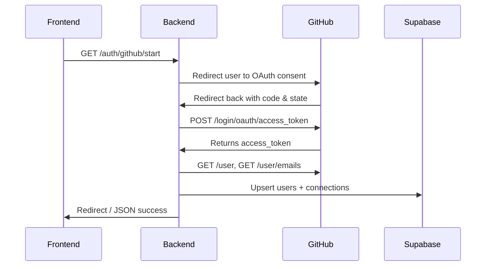

# 🚀 AutoDeploy

### _Auto-Generated, Secure CI/CD Pipelines with AI + MCP_

---

## 🧭 Overview

**AutoDeploy** is a modular platform that automatically provisions and manages secure CI/CD pipelines powered by **AI orchestration (MCP)**.  
It integrates seamlessly with **GitHub Actions**, **Supabase**, and **AWS**, while keeping security and transparency at its core.

---

## 📦 Tech Stack

| Layer        | Technology                                | Description                                        |
| :----------- | :---------------------------------------- | :------------------------------------------------- |
| **Frontend** | React • Tailwind • Zustand                | Developer dashboard (by Victoria)                  |
| **Backend**  | Node.js • Express • PostgreSQL (Supabase) | Orchestration + OAuth + API services (by Lorenc)   |
| **Infra**    | AWS • Terraform • GitHub Actions (OIDC)   | Cloud deployment and workflow automation (by Alex) |
| **Testing**  | Jest • Supertest • Integration scripts    | Unit and integration coverage (by Paython)         |

---

## 🗂️ Project Structure

```bash
mcp-ci-cd-builder/
├── client/                # React + Tailwind + Zustand frontend
│   ├── src/
│   ├── public/
│   └── package.json
├── server/                # MCP orchestrator + adapters
│   ├── src/
│   ├── routes/
│   ├── lib/
│   ├── db.js
│   ├── server.js
│   └── package.json
├── infra/                 # AWS OIDC + GitHub Actions + Terraform
│   ├── workflows/
│   └── terraform/
├── tests/                 # Shared test utilities
│   ├── integration/
│   └── unit/
├── .github/workflows/     # CI configuration
│   └── ci.yml
├── .env.example
└── README.md
```

---

## ⚙️ Backend Architecture

### 🧩 OAuth + User Flow (GitHub)



---

### 📁 Server Layout

```bash
AutoDeploy/
├── server/
│   ├── lib/
│   │   ├── state.js             # CSRF state store (in-memory)
│   │   └── github-oauth.js      # GitHub API helpers
│   ├── routes/
│   │   ├── auth.github.js       # OAuth routes
│   │   ├── deployments.js       # Deployment logs API
│   │   └── usersRoutes.js       # User CRUD endpoints
│   ├── server.js                # Express bootstrap
│   ├── auth.js                  # Generate CSRF protection token
│   ├── db.js                    # Postgres pool + healthCheck()
│   └── ...
├── .env
└── package.json
```

---

## ✅ Current Functionality

| Component             | Status | Description                                        |
| :-------------------- | :----: | :------------------------------------------------- |
| **Express App**       |   ✅   | Clean middleware: CORS, Helmet, JSON, Morgan       |
| **Database**          |   ✅   | Supabase-hosted PostgreSQL connection              |
| **/health**           |   ✅   | Service uptime                                     |
| **/db/ping**          |   ✅   | Database readiness check                           |
| **/users (POST/GET)** |   ✅   | User creation + listing                            |
| **/auth/github/**     |   ✅   | Full OAuth 2.0 flow implemented                    |
| **/auth/github/me**   |   ✅   | Verifies stored token + fetches GitHub user        |
| **/deployments**      |   ⚙️   | Deployment logging API (WIP dashboard integration) |

---

## 🧱 Deployment Logs API

The **Deployment Logs API** provides a lightweight, flexible record of deployment activity from **GitHub Actions** or other CI/CD providers.  
It’s designed to power AutoDeploy’s build history and performance dashboards.

### 🧩 Schema Highlights

- **Status tracking:** `queued`, `running`, `success`, `failed`, `canceled`
- **Context:** `provider`, `repo_full_name`, `environment`, `branch`
- **Timing:** `started_at`, `finished_at`, auto-computed `duration_ms`
- **Metadata:** flexible JSON for provider-specific fields (e.g., run IDs, AWS region)

---

### 🔌 Endpoints

| Method    | Endpoint                  | Description                                        |
| :-------- | :------------------------ | :------------------------------------------------- |
| **POST**  | `/deployments`            | Create a new deployment record (`status = queued`) |
| **PATCH** | `/deployments/:id/status` | Update status and merge metadata                   |
| **GET**   | `/deployments`            | List deployments (filter by repo/env/status)       |
| **GET**   | `/deployments/:id`        | Retrieve a single deployment record by ID          |

---

### 🧠 Example Metadata

```json
{
  "gha_run_id": 5823438279,
  "gha_job_id": 987654321,
  "gha_url": "https://github.com/lorencd/AutoDeploy/actions/runs/5823438279/job/987654321",
  "aws_region": "us-east-1"
}
```

---

## 🔒 Key Features

- 🔐 **CSRF protection** using secure OAuth `state` store
- 🔁 **Idempotent upserts** for users & connections
- 🧩 **Zod validation** for API payloads
- 🧠 **GitHub token verification** before every usage
- 🗄️ **Structured metadata logging** for deployments
- 🧰 **Postgres enum types** for consistent deployment statuses

---

## 🧰 Environment Setup

```bash
# 1. Clone the repo
git clone https://github.com/oslabs-beta/AutoDeploy.git

# 2. Install dependencies
cd server && npm install

# 3. Create your .env file
cp .env.example .env

# 4. Run the backend
npm run dev

# 5. Visit the app
http://localhost:3000
```

---

## 🧩 Future Roadmap

- [ ] 🔑 Encrypt GitHub tokens at rest
- [ ] 🔄 Add PKCE support to OAuth flow
- [ ] 📊 Frontend deployment dashboard
- [ ] 🧵 Slack notifications for failed deploys
- [ ] 🧪 Integration tests for deployment API

---

## 🧾 License

MIT © 2025 AutoDeploy Team
